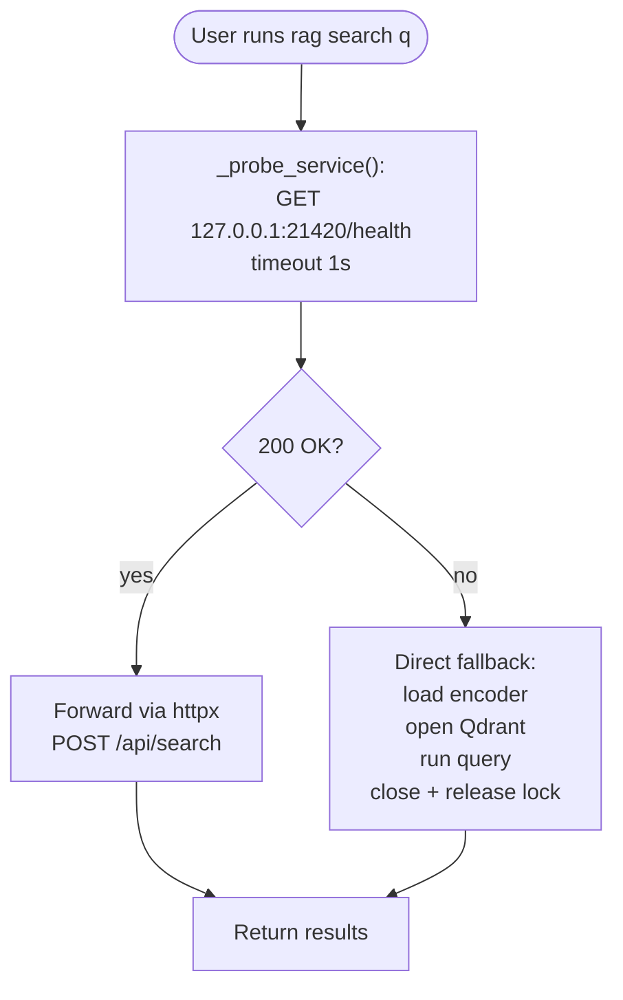

# Architecture: CLI Dual-Mode

| | |
|---|---|
| **Owner** | TBD (proposed: eng lead) |
| **Last validated against version** | 2.4.2 |
| **Last reviewed** | 2026-04-18 |
| **Related decisions** | `docs/decisions.md` — Decision 14 (CLI dual-mode), Decision 1 (single-process) |

## Context

CLI users should not have to think about whether the service is running. Commands that read or write Qdrant must automatically route around it: if the service is up, go through its HTTP API; if not, open Qdrant directly for the command's duration.

## Decision link

- `docs/decisions.md` — CLI dual-mode.
- [Single-Process Invariant](Core-Concepts-Single-Process-Invariant).

## Diagram

## Walkthrough

1. **Entry.** Every service-aware command begins with `settings = _get_settings()`.

2. **Probe.** `_probe_service(settings)` makes a 1-second HTTP `GET` to `/health`. It swallows exceptions — a failure here is a signal, not a crash.

3. **Forward.** On probe success, the command builds a request to the matching `/api/*` endpoint using `httpx` and prints the response. The command never opens Qdrant.

4. **Direct fallback.** On probe failure, the command loads the encoder, opens Qdrant in local mode, runs the operation, and closes the client so the file lock is released for the next command.

## Affected vs non-affected commands

| Command | Dual-mode? | Notes |
|---|---|---|
| `rag search` | Yes (full) | HTTP `/api/search` or direct Qdrant query. |
| `rag index` | **Service required** | As of v2.4.2, `rag index` exits with "Service is not running" if the probe fails — no direct fallback. Start the service first. |
| `rag status` | Yes (full) | HTTP `/api/status` or direct stats read from `index_state.db`. |
| `rag projects` | Yes (full) | HTTP `/api/projects` or direct enumeration. |
| `rag rebuild` | Yes (full) | HTTP `/api/rebuild` or direct drop + reindex. |
| `rag service start / stop / status / install / uninstall` | No | Manage the service itself. |
| `rag doctor` | No | Local diagnostic; does not require Qdrant write. |
| `rag watch` | No | Standalone observer; conflicts with service — use service instead. |
| `rag serve` | No | Starts the MCP server directly. |
| `rag version` | No | Pure local. |
| `rag ignore list / test` | No | Pure local; reads `.ragignore` + config. |

## Code paths

- `src/ragtools/cli.py` — `_probe_service`, `_service_url`, dual-mode pattern per command.
- `src/ragtools/service/routes.py` — matching `/api/*` endpoints.

## Edge cases

- **Service starting (`/health` returns 503)** — probe returns non-200; CLI falls back to direct. Result: lock conflict once the service finishes starting. Recommendation: wait or check `rag service status`.
- **Firewall blocks localhost** — probe times out; direct fallback kicks in; works if the Qdrant lock is free.
- **Service port is resolved from `Settings.service_port`**, not hardcoded: default is 21420 (installed) or 21421 (dev). `RAG_SERVICE_PORT` or `[service].port` in the TOML config override the default. The CLI and MCP probes both read the same `Settings` object, so CLI and service agree as long as they see the same config.

## Invariants

- A probe failure never causes the command to fail; it triggers fallback.
- The direct fallback always releases the Qdrant lock before the command returns.
- The CLI never keeps Qdrant open across commands.
