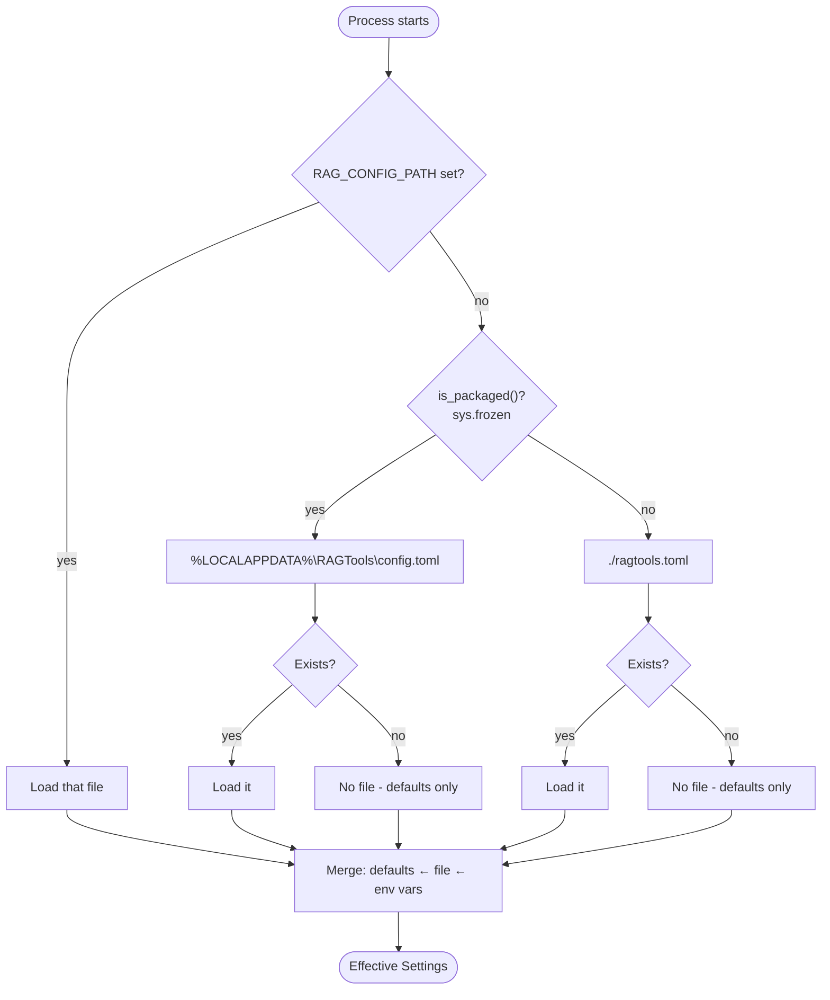

# Architecture: Configuration Resolution Flow

| | |
|---|---|
| **Owner** | TBD (proposed: eng lead) |
| **Last validated against version** | 2.4.2 |
| **Last reviewed** | 2026-04-18 |
| **Related decisions** | `docs/decisions.md` — Decision 4 (config file location/format), Decision 10 (data directories) |

## Context

Every surface (CLI, MCP server, service) must resolve config deterministically. Disagreement between surfaces — e.g. CLI thinks the data dir is `./data/` and the service thinks it is `%LOCALAPPDATA%\RAGTools\data\` — is a whole class of confusing bugs. This flow is the single source of truth for how config is found and layered.

## Decision link

- `docs/decisions.md` — "Config file location and format"; "Data directories".
- [Architecture Decisions](Standards-and-Governance-Architecture-Decisions).

## Diagram

## Walkthrough

Configuration resolves in four steps.

1. **Config file path.** `config.py:_find_config_path()` returns the first match of:
   1. `$RAG_CONFIG_PATH` env var if set.
   2. `%LOCALAPPDATA%\RAGTools\config.toml` if `is_packaged()` is true.
   3. `./ragtools.toml` (CWD-relative) otherwise.
   4. `None` — defaults-only mode.

2. **Load file if present.** TOML parsed into a dict.

3. **Pydantic `Settings` load.** `BaseSettings` layers defaults, then file, then env vars prefixed `RAG_`. Env always wins.

4. **Effective settings frozen.** Returned to the caller. Mutating after this point is a bug.

## Precedence

Highest to lowest:

1. `RAG_*` environment variables.
2. TOML config file (first match of the four-step search above).
3. Code defaults in `Settings` class.

## Code paths

- `src/ragtools/config.py` — `Settings`, `_find_config_path`, `get_data_dir`, `is_packaged`.
- `src/ragtools/config.py:1-16` — precedence stated in file header.

## Edge cases

- `RAG_CONFIG_PATH` points at a non-existent file → error on load (not silently ignored). Explicit paths must resolve.
- Env var present but invalid type (e.g. `RAG_TOP_K=not-a-number`) → Pydantic validation error at startup.
- Packaged build reads `./ragtools.toml` if placed next to the exe? **No.** Installed mode goes to `%LOCALAPPDATA%` unconditionally unless `RAG_CONFIG_PATH` overrides.

## Invariants

- A running service and a CLI command on the same machine resolve to the same effective settings unless the user changed env between them.
- Changing config after startup has no effect until restart (except hot-reloaded fields — see the Settings SOP in Phase 5).
