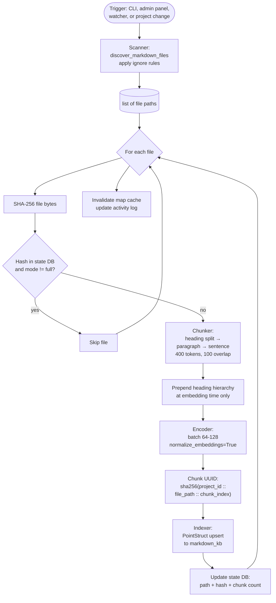

# Architecture: Indexing Pipeline

| | |
|---|---|
| **Owner** | TBD (proposed: eng lead) |
| **Last validated against version** | 2.4.2 |
| **Last reviewed** | 2026-04-18 |
| **Related decisions** | `docs/decisions.md` — Decision 2 (chunking), Decision 3 (embedding model), Decision 5 (deterministic chunk IDs) |

## Context

The indexing pipeline converts Markdown on disk into Qdrant points with stable IDs, minimizing redundant work. Determinism matters: the same file indexed twice must produce the same chunk IDs so upserts are idempotent.

## Decision link

- `docs/decisions.md` — chunking strategy, embedding model, deterministic chunk IDs.

## Diagram

## Walkthrough

1. **Scan.** `scanner.py:discover_markdown_files` walks the content root with `rglob("*.md")`, filters through `SKIP_DIRS` (`.git`, `node_modules`, `.venv`, etc.), and applies the three-layer ignore rules (built-in, config `[ignore].patterns`, `.ragignore` files).

2. **Per-file hash check.** Unless `--full`, the indexer consults `index_state.db`. If the file's SHA-256 matches the recorded hash and the mode is incremental, the file is skipped.

3. **Chunk.** `chunking/markdown.py` splits primarily at `##`, `###`, `####` heading boundaries. Sections that exceed `chunk_size` (400 tokens default) fall back to paragraph splits; paragraphs that still exceed fall back to sentence splits. Overlap of 100 tokens is added.

4. **Heading enrichment.** At embedding time only, the chunk text has its heading hierarchy prepended (e.g. `Architecture > Service\n\n<body>`). The stored payload contains the raw text without headings — so display shows the body while similarity benefits from the heading context.

5. **Encode.** Batches of 64-128 are passed to `SentenceTransformer` with `normalize_embeddings=True`. Encoder access is serialized via `threading.RLock` in `QdrantOwner`.

6. **Deterministic ID.** Chunk UUID = `sha256(project_id::file_path::chunk_index)` formatted as a UUID string. This keeps upserts idempotent and permits incremental re-chunking to replace prior points cleanly.

7. **Upsert.** `PointStruct(id, vector, payload={project_id, file_path, headings, text, chunk_index})` upserted into `markdown_kb`.

8. **State update.** SQLite records the new hash and chunk count. Activity log updated. Map cache invalidated.

## Code paths

- `src/ragtools/indexing/scanner.py` — file discovery, ignore rules.
- `src/ragtools/indexing/state.py` — SQLite state DB.
- `src/ragtools/chunking/markdown.py` — heading / paragraph / sentence splitting.
- `src/ragtools/embedding/encoder.py` — batch encoding, `threading.RLock`.
- `src/ragtools/indexing/indexer.py` — pipeline orchestration, deterministic UUID, upsert.
- `src/ragtools/service/owner.py` — shared encoder and client.

## Edge cases

- **File with only one heading smaller than chunk_size** — single chunk, still with heading prepended.
- **Empty file** — skipped (no chunks).
- **Huge file with no headings** — paragraph/sentence fallback handles it; risk is very low-quality chunks. Add headings upstream.
- **File renamed without content change** — the old path's points become orphans until the next full index (or explicit rebuild of that project). Rename detection is out of scope.
- **File modified during indexing** — SHA-256 is of the bytes read; if the file changes after the hash, the state DB records a stale hash. Watcher picks it up again on the next change event.

## Invariants

- Identical inputs produce identical chunk UUIDs (deterministic).
- Heading hierarchy is in the embedding input but not in the stored payload.
- `QdrantOwner` is the sole writer to the collection.
- Incremental mode never re-embeds a file whose hash is unchanged.
