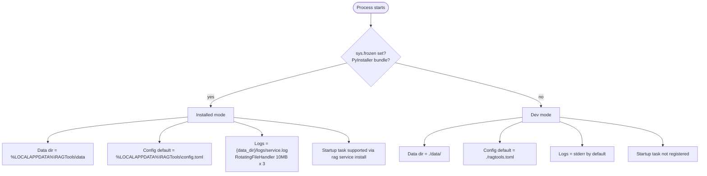

# Architecture: Install Decision Tree

| | |
|---|---|
| **Owner** | TBD (proposed: eng lead) |
| **Last validated against version** | 2.4.2 |
| **Last reviewed** | 2026-04-18 |
| **Related decisions** | `docs/decisions.md` — Decision 9 (logging), Decision 10 (data directories), Decision 11 (Windows startup) |

## Context

Reg behaves differently when running from source (`pip install -e`) versus the Windows installer. The behavioral fork is `config.py:is_packaged()`, which returns `True` iff `sys.frozen` is set — i.e. we are inside a PyInstaller bundle. Every path-resolving and platform-integrating decision branches off this one flag.

## Decision link

- `docs/decisions.md` — data directories, Windows startup, logging.

## Diagram

## Walkthrough

1. **Detection.** `is_packaged()` checks `sys.frozen`. PyInstaller sets it; source installs do not.

2. **Data directory resolves.** `get_data_dir()` returns `%LOCALAPPDATA%\RAGTools\data\` (installed) or `./data/` (dev), or honors `RAG_DATA_DIR` if set.

3. **Config defaults.** In the absence of `RAG_CONFIG_PATH`, installed mode looks at `%LOCALAPPDATA%\RAGTools\config.toml`; dev mode looks at `./ragtools.toml`. See [Configuration Resolution](Architecture-Configuration-Resolution-Flow).

4. **Logging mode.** Service in installed build: `RotatingFileHandler` at `{data_dir}/logs/service.log`, 10 MB per file, 3 backups. Dev / interactive: stderr.

5. **Windows startup integration.** Only applicable when `is_packaged()` is true and the platform is Windows. `rag service install` registers a Task Scheduler entry; dev installs skip this path.

## Code paths

- `src/ragtools/config.py:is_packaged` — PyInstaller detection.
- `src/ragtools/config.py:get_data_dir` — data dir resolution.
- `src/ragtools/config.py:_find_config_path` — config file resolution.
- `src/ragtools/service/startup.py` — Windows Task Scheduler registration.
- `installer.iss` — Inno Setup installer script.

## Edge cases

- Running the frozen binary with `RAG_DATA_DIR=./data/` explicitly — honored; effectively "portable" mode.
- Running from source on Windows with `%LOCALAPPDATA%\RAGTools\` already present (from a prior installed build) — dev mode ignores it unless `RAG_CONFIG_PATH` or `RAG_DATA_DIR` point there.

## Invariants

- Installed and dev builds never share a data directory by default.
- `sys.frozen` is set once at process start; mode cannot change mid-run.
