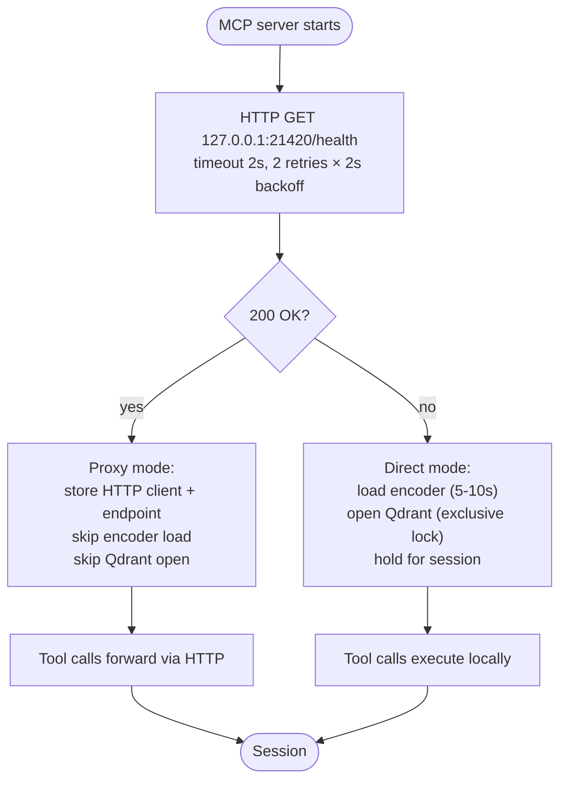

# Architecture: MCP Proxy Decision

| | |
|---|---|
| **Owner** | TBD (proposed: eng lead) |
| **Last validated against version** | 2.4.2 |
| **Last reviewed** | 2026-04-18 |
| **Related decisions** | `docs/decisions.md` — Decision 7 (MCP proxy mode), Decision 1 (single-process) |

## Context

Claude CLI spawns the MCP server per-session. If the MCP server opened Qdrant directly on every launch it would (a) conflict with a running service via the single-process invariant and (b) add 5-10 s to every Claude session via encoder cold-start. The proxy decision is the mechanism that avoids both problems.

## Decision link

- `docs/decisions.md` — MCP proxy mode.
- [Single-Process Invariant](Core-Concepts-Single-Process-Invariant).

## Diagram

## Walkthrough

1. **Probe on initialization.** The MCP server performs one HTTP probe to `/health` with a short timeout and two backoff retries.

2. **Mode decision.** If the probe succeeds, the MCP server enters **proxy mode** and stores the service endpoint and an HTTP client. It never loads the encoder or opens Qdrant. Startup is ~100 ms.

3. **Direct mode fallback.** If the probe fails, the MCP server enters **direct mode**: loads the encoder and opens Qdrant for the lifetime of the session.

4. **Mode is locked for the session.** There is no mid-session switch. If the service dies mid-session while the MCP is in proxy mode, tool calls start failing — the MCP will not try to "take over" direct Qdrant access, because doing so would violate the single-process invariant if the service restarts.

5. **Tool routing.** `search_knowledge_base`, `list_projects`, and `index_status` all branch on the resolved mode.

## Code paths

- `src/ragtools/integration/mcp_server.py:_initialize` — probe + mode selection.
- `src/ragtools/integration/mcp_server.py` — proxy-mode HTTP forwarding.
- `src/ragtools/integration/mcp_server.py` — direct-mode encoder/Qdrant load.

## Edge cases

- **Service starting mid-probe.** If the service is starting and `/health` returns 503, the probe is treated as failure after retries; the MCP enters direct mode even though the service is coming up. Symptom: lock conflict once the service finishes starting. Mitigation: start the service before launching Claude CLI.
- **Port reachable but returns non-200** (e.g. a different listener on 21420): probe fails, MCP enters direct mode. Still conflicts if that other process also holds the Qdrant lock (unlikely). See [Port 21420 In Use](Runbooks-Port-21420-In-Use).

## Invariants

- An MCP session never switches modes after startup.
- In proxy mode the MCP server never opens Qdrant.
- In direct mode the MCP server holds the encoder and Qdrant lock until the session ends.
