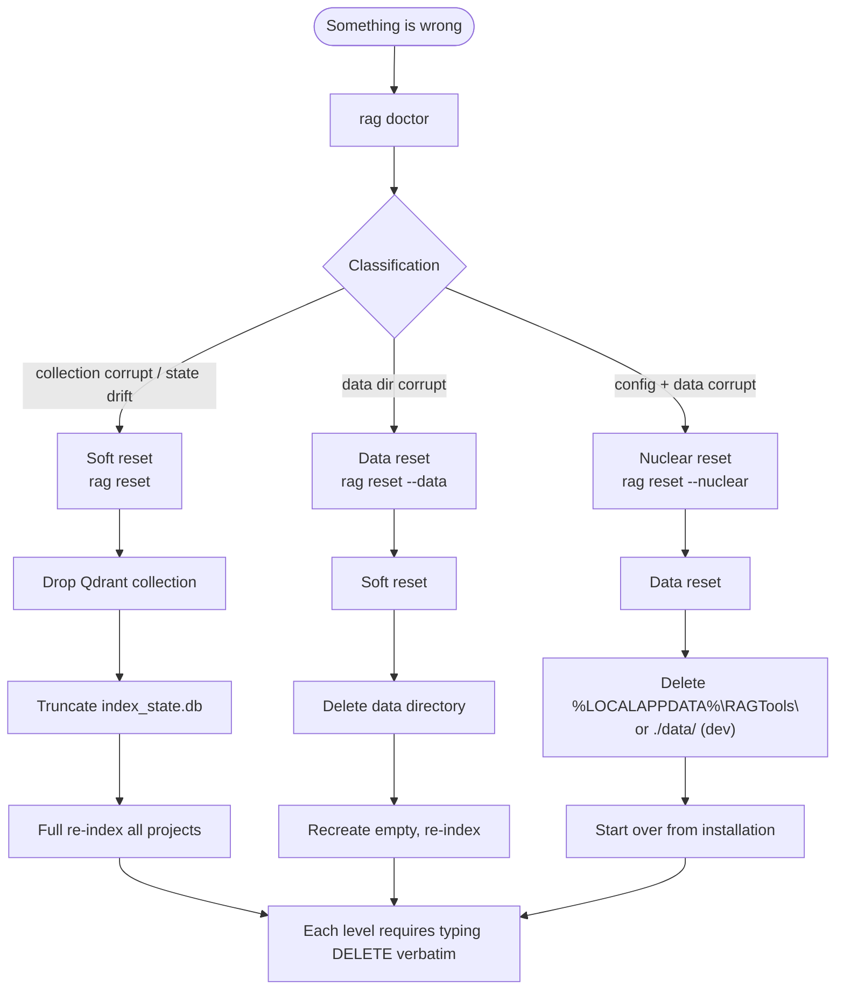

# Architecture: Reset Escalation

| | |
|---|---|
| **Owner** | TBD (proposed: eng lead) |
| **Last validated against version** | 2.4.2 |
| **Last reviewed** | 2026-04-18 |
| **Related decisions** | `docs/decisions.md` — repair and reset levels |

## Context

When state gets into a bad shape, users want three clearly labeled escape hatches, not one giant hammer. Reset escalation exposes **soft**, **data**, and **nuclear** levels — each with explicit scope and an explicit `DELETE` confirmation.

## Decision link

- `docs/decisions.md` — reset / repair levels.
- [Repair Broken Installation](Operational-SOPs-Repair-Repair-Broken-Installation).

## Diagram

## Walkthrough

Every level refuses to run without the user typing `DELETE` exactly. The `/rag:rag-reset` skill enforces this interactively; the CLI `rag reset` command has a matching prompt.

### Soft reset

- Drop the Qdrant collection.
- Truncate the SQLite state table.
- Run a full re-index of all configured projects.
- Watcher continues running; service does not need to restart.

Use when: search returns wrong or missing results but config and data dir are otherwise fine.

### Data reset

- Everything in soft reset.
- Delete the data directory (`./data/` or `%LOCALAPPDATA%\RAGTools\data\`).
- Recreate empty and re-index.

Use when: data files themselves look corrupt (bad SQLite, partial Qdrant segments, stale lock files).

### Nuclear reset

- Everything in data reset.
- Delete the full `%LOCALAPPDATA%\RAGTools\` (installed) or `./data/` (dev) — config, data, and logs.

Use when: you want to start over from a clean installation. Effectively equivalent to uninstall + reinstall for state purposes.

## Version gate

All reset paths refuse to run on installations older than **v2.4.1**. The collection and state schema changed at that release; running reset against an older schema would silently delete data the new code cannot rebuild cleanly. See [Pre-v2.4.1 Reset Blocked](Runbooks-Pre-v2-4-1-Reset-Blocked) and the migration guide [Pre-v2.4.1 to Current](Change-History-Migration-Guides-Pre-v2-4-1-to-Current). Schema details are tracked as [Q-7](Development-SOPs-Documentation-Open-Questions).

## Code paths

- `src/ragtools/cli.py` — `reset` command.
- `src/ragtools/service/routes.py` — `/api/rebuild` (soft-reset path when service is up).
- `.claude/skills/rag:rag-reset` — interactive escalation.

## Edge cases

- **Service running at reset time** — soft reset can go through `/api/rebuild`; data and nuclear resets require stopping the service first (Qdrant lock + file-in-use).
- **Data dir symlinked elsewhere** — deletion follows the symlink; nuclear deletion is physical.
- **Partial deletion interrupted** — re-run the same level; each level is idempotent on re-invocation.

## Invariants

- Reset cannot run without explicit `DELETE` confirmation.
- Each escalation level is a strict superset of the one below.
- Soft and data resets preserve config; nuclear deletes everything.
