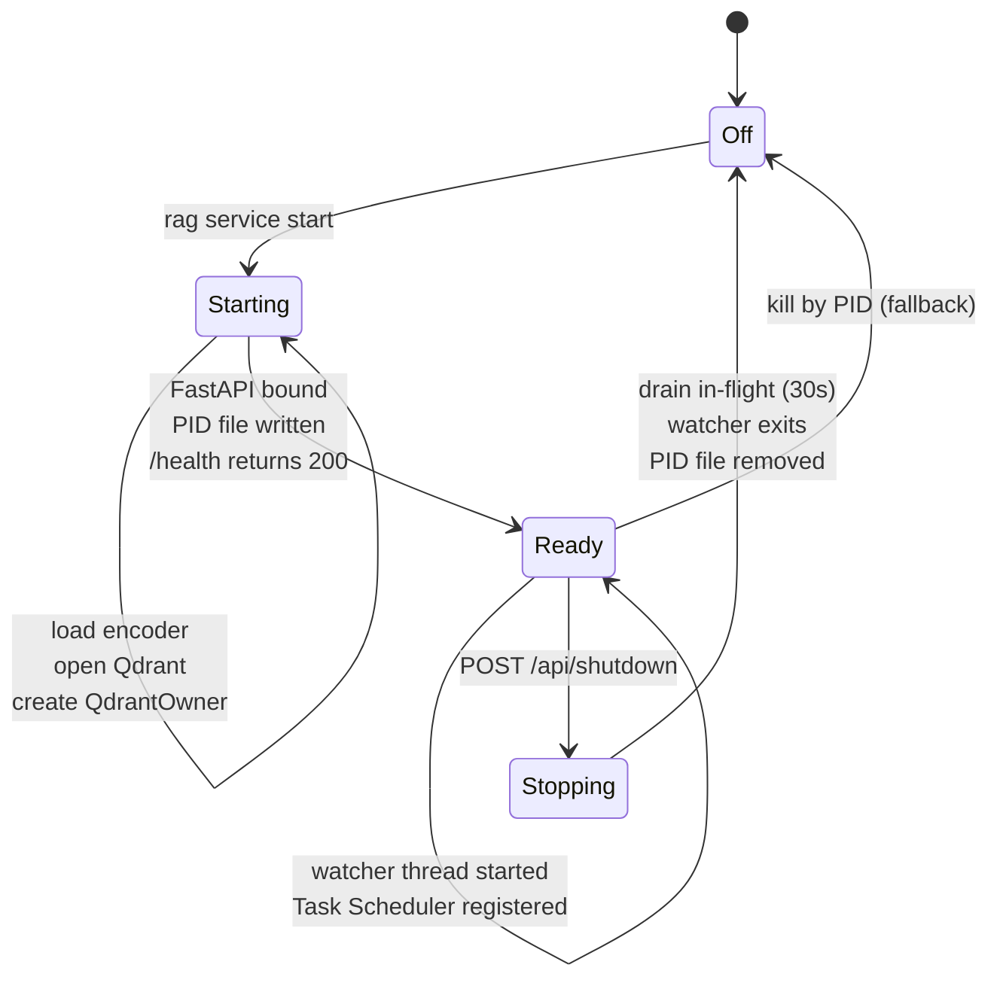

# Architecture: Service Lifecycle

| | |
|---|---|
| **Owner** | TBD (proposed: eng lead) |
| **Last validated against version** | 2.4.2 |
| **Last reviewed** | 2026-04-18 |
| **Related decisions** | `docs/decisions.md` — Decision 1 (single-process), Decision 8 (service lifecycle), Decision 9 (logging) |

## Context

The service is a long-running process that owns Qdrant exclusively. Start and stop sequences must be reliable on Windows (no `fork`) and must recover cleanly when a prior run left stale PID files.

## Decision link

- `docs/decisions.md` — service lifecycle, single-process Qdrant.

## Diagram

## Walkthrough

### Start

1. `rag service start` spawns a detached subprocess on Windows (`CREATE_NO_WINDOW`, `DETACHED_PROCESS`).
2. Subprocess executes `python -m ragtools.service.run` (or the packaged equivalent).
3. Config loads.
4. Encoder initializes (`SentenceTransformer("all-MiniLM-L6-v2")`, 5-10 s on CPU).
5. Qdrant client opens (exclusive lock acquired).
6. `QdrantOwner` singleton constructed.
7. FastAPI + Uvicorn bind `127.0.0.1:<service_port>` — `21420` in installed mode, `21421` in dev mode (`Settings.service_port`).
8. `/health` returns **503** during startup, **200** once ready.
9. Post-startup thread:
   - Starts the watcher daemon for enabled projects.
   - Registers the Windows Task Scheduler startup task if configured.
   - Opens the admin panel in a browser if `[startup].open_browser = true`.
10. PID file written to `{data_dir}/service.pid`.

### Shutdown (graceful)

1. `rag service stop` sends `POST /api/shutdown`.
2. Service sets a shutdown event.
3. Watcher thread observes the event and stops queuing new work.
4. FastAPI finishes in-flight requests (30 s timeout).
5. Process exits; PID file deleted.

### Shutdown (fallback)

If `/api/shutdown` is unreachable (service hung or partially started), `rag service stop` reads the PID file and terminates the process via the Windows process API.

## Code paths

- `src/ragtools/service/run.py` — `main()` startup orchestration.
- `src/ragtools/service/process.py` — subprocess spawn, PID file management.
- `src/ragtools/service/routes.py` — `/health`, `/api/shutdown`.
- `src/ragtools/service/owner.py` — `QdrantOwner`.
- `src/ragtools/service/watcher_thread.py` — watcher start/stop.
- `src/ragtools/service/startup.py` — Task Scheduler integration.

## Edge cases

- **Stale PID file** from a crashed prior run: `rag service start` detects the PID is not alive and overwrites.
- **Service port already bound** (21420 installed / 21421 dev) by another process: bind fails; service exits non-zero; CLI reports startup failure. See [Port 21420 In Use](Runbooks-Port-21420-In-Use).
- **Qdrant lock held** by a rogue process: Qdrant open fails; service exits. See [Qdrant Lock Contention](Runbooks-Qdrant-Lock-Contention).
- **Shutdown while watcher is mid-batch**: watcher releases the `QdrantOwner` lock between files; shutdown event is observed at the next boundary.

## Invariants

- At most one service process exists per data directory.
- `/health` never returns 200 until Qdrant is open and the encoder is loaded.
- The PID file accurately reflects the running process ID while the service is alive; a surviving PID file with no live process is a recoverable error that the start path must handle.
