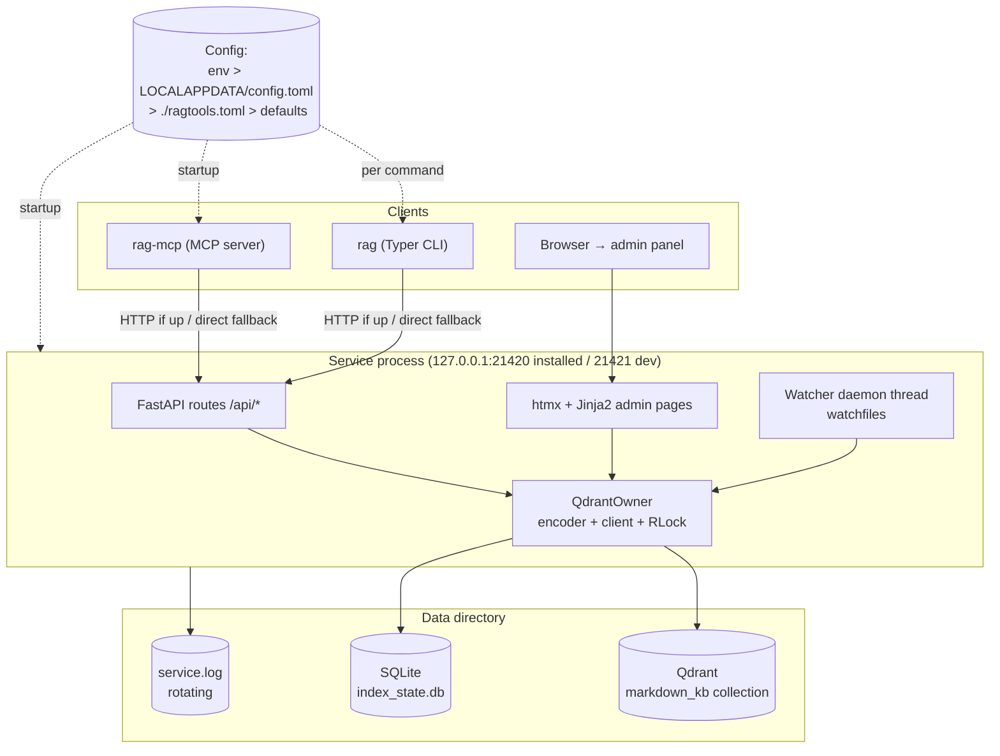

# Architecture: System Overview

| | |
|---|---|
| **Owner** | TBD (proposed: eng lead) |
| **Last validated against version** | 2.4.2 |
| **Last reviewed** | 2026-04-18 |
| **Related decisions** | `docs/decisions.md` — Decision 1 (single-process Qdrant), 6 (htmx admin), 7 (MCP proxy), 14 (CLI dual-mode) |

## Context

Reg is five cooperating surfaces sharing one Qdrant store. This page is the canonical component map that every other architecture page refers back to. If you only read one architecture page, read this one.

## Decision link

See [Architecture Decisions](Standards-and-Governance-Architecture-Decisions) — rendered index of `docs/decisions.md`.

## Diagram

## Walkthrough

1. **Config resolves first.** Every surface resolves config before doing anything else. See [Configuration Resolution](Architecture-Configuration-Resolution-Flow).

2. **The service is the sole Qdrant owner when running.** CLI and MCP clients probe `/health`; on success they go via HTTP, on failure they open Qdrant themselves transiently. See [Single-Process Invariant](Core-Concepts-Single-Process-Invariant), [CLI Dual-Mode](Architecture-CLI-Dual-Mode), [MCP Proxy Decision](Architecture-MCP-Proxy-Decision).

3. **QdrantOwner serializes all Qdrant and encoder access.** API routes, admin-panel views, and the watcher thread all go through the same singleton with a `threading.RLock`. No path opens Qdrant twice.

4. **The watcher lives inside the service.** It's a daemon thread, not a subprocess, so it shares the lock with HTTP handlers. See [Watcher Flow](Architecture-Watcher-Flow).

5. **Admin panel is not a separate process.** htmx + Jinja2 templates served by the same FastAPI app. No npm, no React.

## Code paths

- `src/ragtools/cli.py` — Typer entry + `_probe_service` + dual-mode dispatch.
- `src/ragtools/integration/mcp_server.py` — MCP startup probe, proxy/direct mode.
- `src/ragtools/service/run.py` — service main.
- `src/ragtools/service/routes.py` — HTTP API and admin pages.
- `src/ragtools/service/owner.py` — `QdrantOwner`.
- `src/ragtools/service/watcher_thread.py` — watcher daemon.
- `src/ragtools/config.py` — config and path resolution.

## Edge cases

- **Two CLI processes concurrently when service is down.** Both will try to open Qdrant; one wins the lock, the other errors. See [Qdrant Lock Contention](Runbooks-Qdrant-Lock-Contention).
- **MCP and CLI both in direct mode.** Same failure class. Guidance: start the service.
- **Service port already bound** (21420 installed or 21421 dev). Service fails to start; `/health` probes by CLI/MCP fall through to direct mode. See [Port 21420 In Use](Runbooks-Port-21420-In-Use).

## Invariants

- Only one process at a time holds the Qdrant lock.
- The service, when running, is always that process.
- Every surface resolves config through the same precedence chain.
- `QdrantOwner` is the only object in the service that touches Qdrant.
