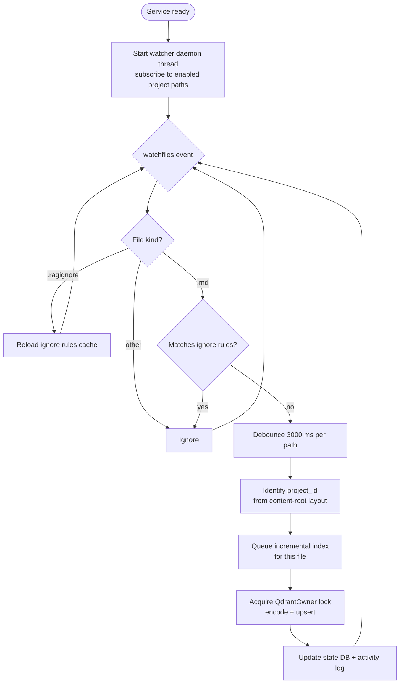

# Architecture: Watcher Flow

| | |
|---|---|
| **Owner** | TBD (proposed: eng lead) |
| **Last validated against version** | 2.4.2 |
| **Last reviewed** | 2026-04-18 |
| **Related decisions** | `docs/decisions.md` — Decision 12 (thread safety), Decision 15 (watcher unavailable paths) |

## Context

The watcher gives users "edit a Markdown file, search finds it seconds later" behavior without re-indexing whole projects. It runs as a daemon thread inside the service process — sharing the same `RLock` as the HTTP API — so it cannot conflict with user-triggered indexes.

## Decision link

- `docs/decisions.md` — thread safety, watcher unavailable paths.

## Diagram

## Walkthrough

1. **Initialization.** When the service reaches "ready", it starts a daemon thread and subscribes the `watchfiles` observer to all enabled project paths.

2. **Event arrives.** `watchfiles` (Rust-based, uses OS primitives: inotify / FSEvents / `ReadDirectoryChangesW`) surfaces file create / modify / delete events.

3. **Kind check.**
   - `.ragignore` changed → reload that directory's ignore rules; no index action.
   - `.md` changed → continue.
   - Anything else → drop.

4. **Ignore filter.** The three-layer ignore engine (built-in defaults, config `[ignore].patterns`, per-directory `.ragignore` files) checks the path. Match → drop.

5. **Debounce.** A 3000 ms per-path debounce collapses editor save-storms (swap-file flurries, save-on-focus-loss) into one action.

6. **Project identification.** The file's first path segment relative to the content root is the `project_id`.

7. **Incremental index.** The file is hashed; if changed, re-chunked and re-encoded; points upserted; state DB updated. The lock is released between files so HTTP requests are not starved.

8. **Unavailable paths.** If a watched directory disappears (network share offline, USB unplugged), the observer logs a warning and retries every 60 s. The service does not crash.

9. **Project changes.** Adding, removing, enabling, or disabling a project restarts the watcher with the new subscription set.

## Code paths

- `src/ragtools/watcher/observer.py` — `watchfiles` wrapper, debounce.
- `src/ragtools/service/watcher_thread.py` — daemon thread, lifecycle.
- `src/ragtools/indexing/scanner.py` — ignore-rule reload on `.ragignore` change.
- `src/ragtools/service/owner.py` — shared RLock.

## Edge cases

- **Bulk change (git pull, IDE rename)** — debounce coalesces per path, but a single pull touching 500 files produces 500 queued indexes; they serialize behind the lock.
- **File moved across projects** — treated as delete from the old project and add to the new.
- **Symlinks** — `watchfiles` follows them by default; avoiding infinite loops is the user's responsibility.
- **Permission denied on a subdirectory** — logged and skipped. See [Watcher Permission Denied](Runbooks-Watcher-Permission-Denied).
- **Watcher thread dies** — the service does not auto-restart the thread in the current design. Known hardening gap.

## Invariants

- The watcher thread does not hold the `QdrantOwner` lock across files — only during encode + upsert of one file.
- The watcher subscribes only to enabled projects.
- `.ragignore` changes always reload the ignore cache before the next index attempt.
