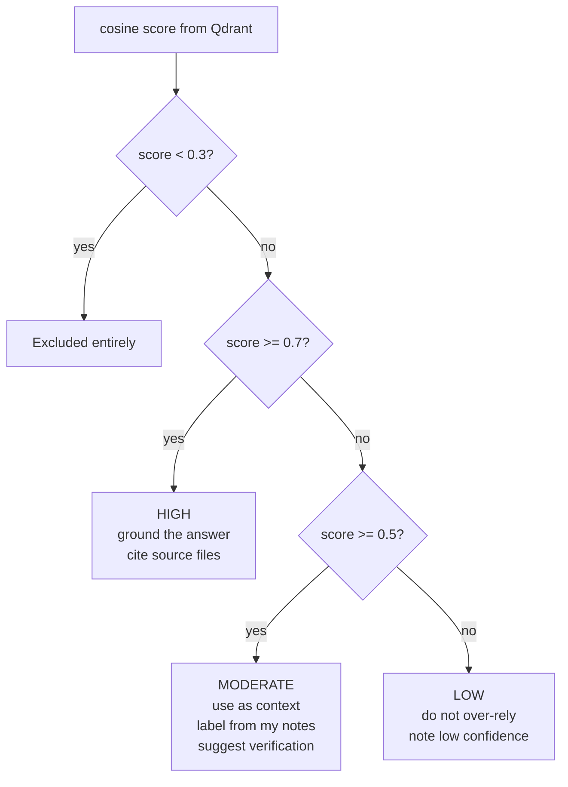

# Confidence Model

| | |
|---|---|
| **Owner** | TBD (proposed: eng lead) |
| **Last validated against version** | 2.4.2 |
| **Last reviewed** | 2026-04-18 |

## What the score is

Each search result carries a cosine similarity score from `all-MiniLM-L6-v2`. Because embeddings are normalized at both index time and query time, scores are in `[0.0, 1.0]` — higher means more similar.

## Threshold and bands

| Band | Range | User-facing behavior |
|---|---|---|
| **Excluded** | < `RAG_SCORE_THRESHOLD` (default `0.3`) | Not returned. |
| **LOW** | `[0.3, 0.5)` | Returned with a visible "low confidence" label. Answers should note this. |
| **MODERATE** | `[0.5, 0.7)` | Returned as context. Label as "from my notes" and recommend the user verify. |
| **HIGH** | `>= 0.7` | Ground the answer directly. Cite source files inline. |

## Why these numbers

Chosen empirically against the evaluation harness (`scripts/eval_retrieval.py`) and the fixture questions in `tests/fixtures/eval_questions.json`. The threshold balances recall against noise — below 0.3, results for this model are dominated by generic token overlap rather than topical relevance.

## Consumer contract

The MCP server and the admin panel both surface the confidence band alongside the raw score. The retrieval rule in the project `CLAUDE.md` defines the exact language expected in answers:

- **HIGH** — "ground the answer in them and cite source files inline."
- **MODERATE** — "label as 'from my notes:' and suggest the user verify."
- **LOW / empty** — "I checked your knowledge base and didn't find information about X."

## Related

- [Configuration Keys](Reference-Configuration-Keys) — `RAG_SCORE_THRESHOLD`, `RAG_TOP_K`.
- [Indexing Pipeline](Architecture-Indexing-Pipeline).

## Code paths

- `src/ragtools/retrieval/searcher.py` — threshold filtering.
- `src/ragtools/retrieval/formatter.py` — band assignment and rendering.
