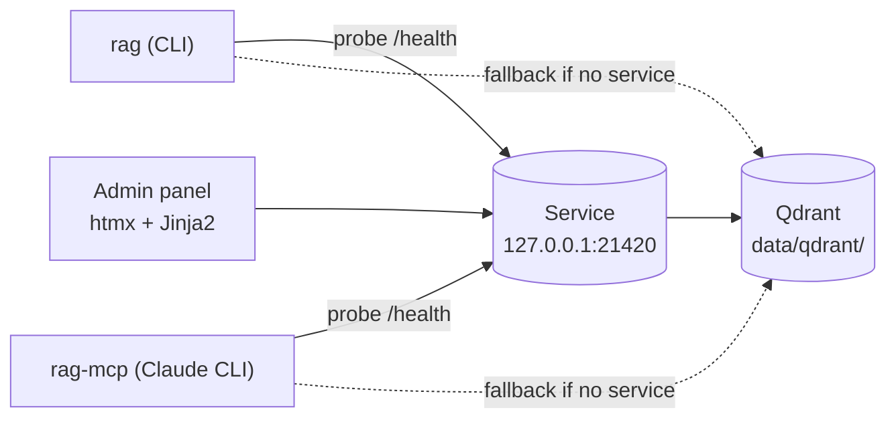

# Single-Process Invariant

| | |
|---|---|
| **Owner** | TBD (proposed: eng lead) |
| **Last validated against version** | 2.4.2 |
| **Last reviewed** | 2026-04-18 |
| **Related decision** | `docs/decisions.md` — Decision 1 (single-process Qdrant) |

## The rule

**Only one process at a time may open the Qdrant data directory.**

Qdrant's local mode (`QdrantClient(path="./data/qdrant")`) takes an exclusive file lock on the storage directory. A second process that tries to open the same path will fail — or, worse, silently corrupt state. This is the most important operational constraint in Reg.

## Who owns the lock

| Situation | Lock holder |
|---|---|
| Service running | The service process. |
| Service not running, CLI command in flight | The CLI process, transiently, for the duration of that one command. |
| Service not running, MCP direct mode | The MCP server process, for its whole session. |

## What everything else does

All other clients reach Qdrant by going through the service over HTTP instead of opening Qdrant themselves:

- **CLI** probes `/health`, forwards over HTTP if alive, falls back to direct Qdrant if not. See [CLI Dual-Mode](Architecture-CLI-Dual-Mode).
- **MCP server** does the same probe at startup; mode is locked for the session. See [MCP Proxy Decision](Architecture-MCP-Proxy-Decision).
- **Admin panel** always goes via the service (the admin panel *is* the service).

## How violation shows up

- Second process gets a lock error on startup (Qdrant storage already open).
- Or, worse, both processes appear to open it and the store silently corrupts.
- Symptoms include missing or duplicated points, failed upserts, and inconsistent search results.

See [Qdrant Lock Contention](Runbooks-Qdrant-Lock-Contention).

## Do not

- Run `rag index` directly while the service is running (use `/api/index` via the service or let the CLI forward).
- Run `rag rebuild` while Claude CLI has an active MCP session in direct mode.
- Open `data/qdrant/` with an external Qdrant client or viewer.
- Copy a live data directory to a second machine and run both against it.

## Do

- Start the service once (`rag service start`) and let everything else go through it.
- Check `rag service status` before any direct-mode operation.
- When repairing, stop the service first (`rag service stop`), then run repair tools, then restart.

## Related

- [Service Lifecycle](Architecture-Service-Lifecycle).
- [CLI Dual-Mode](Architecture-CLI-Dual-Mode).
- [MCP Proxy Decision](Architecture-MCP-Proxy-Decision).
- [Qdrant Lock Contention](Runbooks-Qdrant-Lock-Contention).

## Code paths

- `src/ragtools/service/owner.py` — `QdrantOwner` singleton + `threading.RLock`.
- `src/ragtools/config.py` — Qdrant client construction.
