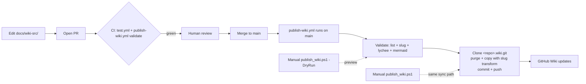

# SOP: Wiki Publishing Process

| | |
|---|---|
| **Owner** | TBD (proposed: docs lead) |
| **Last validated against version** | 2.4.2 |
| **Last reviewed** | 2026-04-18 |
| **Status** | Active |

## Purpose
Sync the authoritative source at `docs/wiki-src/` to the published GitHub Wiki so readers always see the reviewed state, and direct wiki-UI edits are caught and overwritten.

## Scope
Covers both publish paths:

- **Manual** — `scripts/publish_wiki.ps1` (PowerShell; run locally).
- **CI** — `.github/workflows/publish-wiki.yml` (GitHub Actions; runs on `main` push touching `docs/wiki-src/**`).

Does not cover authoring individual pages (see [Documentation Standards](Standards-and-Governance-Documentation-Standards)).

## Publish flow



## Trigger
- A PR touching `docs/wiki-src/**` merges to `main`.
- Manual republish needed — e.g. after an accidentally deleted wiki page.
- A workflow-dispatch run with `dry_run=false`.

## Preconditions
- [ ] Push access to `<repo>.wiki.git` (GitHub Actions uses `GITHUB_TOKEN`; manual runs use the user's git credentials).
- [ ] Local clone on `main` and up to date (manual path only).
- [ ] No uncommitted changes under `docs/wiki-src/`.
- [ ] **Wiki has been initialized** — create one page manually in the GitHub UI the first time. `.wiki.git` cannot be cloned until at least one wiki page exists.

## Inputs
- Source: `docs/wiki-src/` tree.
- Target: `<repo>.wiki.git` remote URL (derived automatically from `origin` or passed via `-WikiRemote` / `RAG_WIKI_REMOTE`).

## Slug transform

Wiki pages publish at the root of the wiki repo — subdirectories don't work there. The slug transform mirrors the folder hierarchy into filenames:

- `_Sidebar.md`, `_Footer.md`, `Home.md` — copied as-is (wiki special files).
- Other pages: `Folder/Sub/Page.md` → `Folder-Sub-Page.md`. Dots in path segments become dashes (e.g. `Pre-v2.4.1-to-Current.md` → `Pre-v2-4-1-to-Current.md`).

Both the PowerShell script and the CI workflow use identical transform logic, so manual and CI runs produce byte-identical output.

## Steps — CI path (production)

Triggered automatically on merge to `main` when the diff touches `docs/wiki-src/**`, `.github/workflows/publish-wiki.yml`, or `scripts/publish_wiki.ps1`.

1. **Validate job:**
   - Lists the page set.
   - Previews slug transforms.
   - Runs `markdownlint-cli2` (informational).
   - Runs `lycheeverse/lychee-action` offline link check (blocking — fails on broken links).
   - Runs a Mermaid sanity check for unclosed fences and diagram-type lead lines (informational).
2. **Publish job** (skipped if `workflow_dispatch` with `dry_run=true`):
   - Clones `<repo>.wiki.git`.
   - Purges everything except `.git`.
   - Copies `docs/wiki-src/**/*.md` (not `.gitkeep`) into the wiki clone with the slug transform.
   - Commits `docs(wiki): sync from <short-sha>`.
   - Pushes.

Concurrency group `publish-wiki` prevents overlapping runs from racing.

## Steps — manual path (local)

Use when debugging the sync logic or doing a one-off republish:

1. From the repo root, run `scripts/publish_wiki.ps1 -DryRun` and confirm the slug list matches expectations.
2. Run `scripts/publish_wiki.ps1` to clone the wiki, purge, copy, commit, push.
3. Open the wiki in a browser; spot-check sidebar + changed pages.

## Validation / expected result
- Wiki Home, sidebar, and all changed pages match the committed source.
- No broken internal links (lychee passes).
- No unrendered Mermaid blocks — confirmed visually on a spot-check of changed pages.
- Commit on the wiki repo matches the source-sha short prefix.

## Failure modes
| Symptom | Likely cause | Fix |
|---|---|---|
| Wiki not cloneable (CI or manual) | Wiki never initialized | Create one page manually in the GitHub UI, then re-run. |
| Links broken after publish | Body uses source paths instead of slug form | Link using the slug form (e.g. `Operational-SOPs-Installation-Fresh-Install-Dev`). See [Documentation Standards](Standards-and-Governance-Documentation-Standards). |
| Merge conflict on push | Someone edited the wiki UI directly | Wiki UI edits are not authoritative; the CI workflow force-overwrites on next run. Notify the editor to submit a PR against `docs/wiki-src/`. |
| Lychee link check fails in CI | Relative-link target renamed or missing | Fix the link in the source page; re-merge. |
| Mermaid sanity check warns | Unclosed ```` ```mermaid ``` ```` fence or non-standard diagram type | Inspect the flagged file; fix the diagram. |
| Publish job runs on workflow_dispatch dry-run | Misconfig of the dispatch input | Re-run with `dry_run=true` explicitly, or leave default (`false`) for real publish. |
| Manual and CI output diverge | One was run against a different commit | Always run manual with `-DryRun` first and compare output to the last CI validate log. |

## Recovery / rollback
The wiki is a separate git repo. To revert the last publish:

```
cd <wiki-clone>
git reset --hard HEAD~1
git push -f
```

Follow this with a source-repo fix so the next merge does not republish the broken state.

## Related code paths
- `.github/workflows/publish-wiki.yml` — CI path.
- `scripts/publish_wiki.ps1` — manual path.
- `.github/workflows/docs-freshness.yml` — monthly staleness audit (not part of the publish path but shares the metadata conventions documented in [Documentation Standards](Standards-and-Governance-Documentation-Standards)).

## Related commands
- `scripts/publish_wiki.ps1 [-DryRun] [-WikiRemote <url>]`
- Manual workflow dispatch via the GitHub Actions UI for `publish-wiki.yml` — use `dry_run=true` to validate without pushing.

## Change log
- 2026-04-18 — Promoted from Phase 1 draft to Phase 10 active SOP. CI workflow activated with lychee link checking and slug-transform parity.
