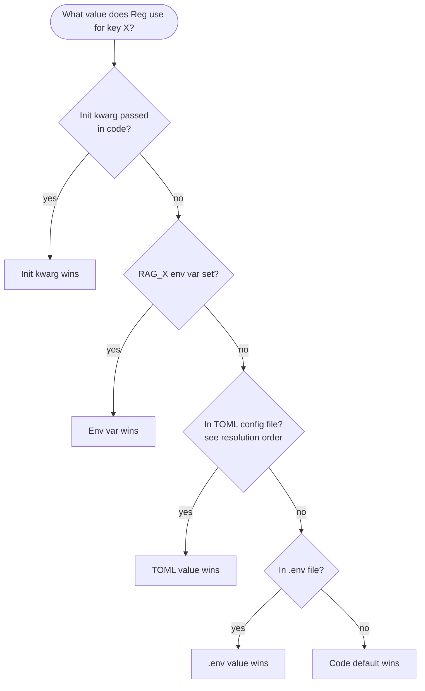

# SOP: Configuration Precedence

| | |
|---|---|
| **Owner** | TBD (proposed: ops lead) |
| **Last validated against version** | 2.4.2 |
| **Last reviewed** | 2026-04-18 |
| **Status** | Draft |

## Purpose
Diagnose and resolve "I set X but Reg still does Y" — reconcile the intended config against the effective config, then apply the correct fix at the correct layer.

## Scope
All config knobs exposed through env vars, the TOML config file, and defaults. For the engineering-level flow see [Configuration Resolution Flow](Architecture-Configuration-Resolution-Flow).

## Trigger
- A setting change does not appear to take effect.
- Two surfaces (CLI / service / MCP) disagree about behavior.
- Port / data-dir / chunk-size / threshold behaving unexpectedly.

## Preconditions
- [ ] The key you expect to control the behavior (e.g. `service_port`, `score_threshold`).
- [ ] Knowledge of whether you set it via env, TOML, or elsewhere.
- [ ] Shell access with permission to read env and the config file.

## Inputs
- The key of interest (Pydantic field name) and its intended value.
- Current shell: whether the env var is set in *this* shell or another.

## Precedence (at a glance)

Highest to lowest:

1. **Init kwargs** (programmatic — rare, used in tests).
2. **Environment variables** prefixed `RAG_`.
3. **TOML config file** (first match of: `RAG_CONFIG_PATH`, `%LOCALAPPDATA%\RAGTools\config.toml` if packaged, `./ragtools.toml` if dev).
4. **`.env` file** at project root.
5. **Code defaults** in the `Settings` class.

## Steps

1. **Pin down the exact key.** Convert from friendly name to Pydantic field name using [Configuration Keys](Reference-Configuration-Keys). Example: `service port` → `service_port` → env var `RAG_SERVICE_PORT` → TOML `[service].port`.

2. **Check environment.** In the shell where the process runs:
   - macOS/Linux: `env | grep '^RAG_'`
   - Windows (PowerShell): `Get-ChildItem Env: | Where-Object Name -like 'RAG_*'`
   - Windows (cmd): `set RAG_`

3. **Identify the active config file.** Run `rag doctor` — it prints which config file was resolved. The file order is documented above and in [Configuration Resolution Flow](Architecture-Configuration-Resolution-Flow).

4. **Inspect the file.** Open the identified config file. Check for the `[section].key` entry matching your Pydantic field (see [Configuration Keys](Reference-Configuration-Keys) for the mapping).

5. **Compute the effective value.** Apply the precedence above: env beats TOML; TOML beats `.env`; `.env` beats defaults.

6. **Compare to observed behavior.** If the expected effective value matches what the code should use but the behavior is still wrong, this is a bug — not a config issue. Capture `rag doctor` output and the config file and open an issue.

7. **Apply the fix at the right layer:**
   - For a **user preference**: update the TOML config file.
   - For a **per-run override**: set `RAG_*` env var before launching the process.
   - For a **test-only override**: init kwargs or monkey-patch.
   - After changing: restart whatever process holds the config (service / MCP session / CLI picks it up next run).

## Validation / expected result
- `rag doctor` shows the new value in its reported settings block.
- The behavior you expected is now observed.
- For service-held config (e.g. port, data dir): `rag service restart` (or stop + start) actually picks up the new value.

## Failure modes

| Symptom | Likely cause | Fix |
|---|---|---|
| Env var set but ignored | Set in a different shell scope than the process; service started before the env was set | Restart the process from a shell where the env var is visible. |
| Two services running with different config | One service launched from dev env, another from installed context | Stop one. Keep one canonical process. See [Start and Stop Service](Operational-SOPs-Service-Start-and-Stop-Service). |
| Change to TOML has no effect | Service was not restarted; config is read at startup | `rag service restart`. |
| `RAG_EMBEDDING_MODEL` changed but search quality regresses | Changing the model requires a full rebuild of the index | `rag reset` and re-index. See [Reset Escalation](Architecture-Reset-Escalation). |
| Dev install picks up installed-mode config accidentally | `RAG_CONFIG_PATH` was set globally | Unset or re-point it. |
| `ragtools.toml` in CWD ignored | You launched from a different CWD than the repo root | Run from repo root, or use `RAG_CONFIG_PATH` for an explicit path. |

## Recovery / rollback
- Unset the `RAG_*` env var or revert the TOML change.
- If config file was corrupted: move it aside and let defaults apply (`rag doctor` reports "defaults only"), then rebuild from `Reference/Configuration-Keys`.

## Related code paths
- `src/ragtools/config.py:Settings` — Pydantic settings class.
- `src/ragtools/config.py:_find_config_path` — file resolution.
- `src/ragtools/config.py:settings_customise_sources` — Pydantic source priority (init > env > TOML > .env > defaults).

## Related commands
- `rag doctor` — reports effective config and resolved paths.
- `rag service status / restart` — apply new config to the service.
- `rag config edit` — (if available; see [Configuration Keys](Reference-Configuration-Keys)).

## Change log
- 2026-04-18 — Initial draft.
