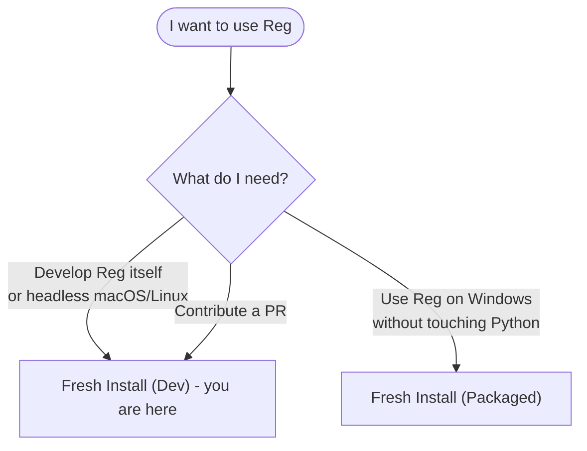

# SOP: Fresh Install (Dev)

| | |
|---|---|
| **Owner** | TBD (proposed: eng lead) |
| **Last validated against version** | 2.4.2 |
| **Last reviewed** | 2026-04-18 |
| **Status** | Draft |

## Purpose
Stand up a working Reg development environment from a fresh clone — for contributors, for headless macOS/Linux users, and for anyone running Reg from source.

## Scope
Covers source install via `pip install -e ".[dev]"`. Does NOT cover the Windows installer (see [Fresh Install (Packaged)](Operational-SOPs-Installation-Fresh-Install-Packaged)), upgrades (Phase 6 Release SOP), or repair (see [Repair Broken Installation](Operational-SOPs-Repair-Repair-Broken-Installation)).

## Which install path should I use?



## Trigger
- New contributor onboarding.
- Setting up a clean dev environment after machine change.
- Reproducing an issue in a clean environment.

## Preconditions
- [ ] Python **3.10 or newer** available (`python --version` shows `3.10.x` or higher; 3.12 recommended). `pyproject.toml` requires `>=3.10`.
- [ ] Git installed.
- [ ] Write access to the target directory.
- [ ] No existing `rag` / `rag-mcp` binary on `PATH` that would shadow the new install.
- [ ] If a prior installed build is present on Windows, it does not conflict with this dev install (dev mode ignores `%LOCALAPPDATA%\RAGTools\` by default — see [Configuration Resolution](Architecture-Configuration-Resolution-Flow)).

## Inputs
- Repo URL: `https://github.com/taqat-techno/rag.git`.
- Target directory (absolute path) for the clone.

## Steps

1. **Clone:**
   ```
   git clone https://github.com/taqat-techno/rag.git
   cd rag
   ```

2. **Create a virtual environment (Python 3.12):**
   ```
   python -m venv .venv
   ```

3. **Activate:**
   - Windows (cmd): `.venv\Scripts\activate`
   - Windows (PowerShell): `.venv\Scripts\Activate.ps1`
   - macOS / Linux: `source .venv/bin/activate`

4. **Install in editable mode with dev extras:**
   ```
   pip install -e ".[dev]"
   ```
   Registers the `rag` and `rag-mcp` entry points.

5. **Run the verification probe:**
   ```
   rag version
   rag doctor
   ```
   `rag doctor` is the canonical readiness check — it prints config path, data dir, service status, encoder availability.

6. **Run the test suite (optional, recommended for contributors):**
   ```
   pytest
   ```
   All tests use `QdrantClient(":memory:")`; no on-disk Qdrant is touched.

7. **Optional — start the service:**
   ```
   rag service start
   ```
   Admin panel binds on `http://127.0.0.1:21421` (dev default; installed mode uses 21420 to avoid collisions — see [Configuration Keys](Reference-Configuration-Keys)).

## Validation / expected result

- `rag version` prints the `pyproject.toml` version.
- `rag doctor` exits `0` and shows no BLOCKER lines.
- Import probe: `python -c "import ragtools; print(ragtools.__version__)"` prints the version.
- If service was started: `curl http://127.0.0.1:21421/health` returns **200** once the encoder has loaded (5-10 s the first time).
- Directory `./data/` is created only on first index or first service start — its absence before that is normal.

## Failure modes

| Symptom | Likely cause | Fix / Runbook |
|---|---|---|
| `python: command not found` | Python 3.12 not on PATH | Install Python 3.12 (python.org) or use `py -3.12` on Windows. |
| `pip install ... fails on torch wheel` | CPU/wheel mismatch or no network | Retry on a stable connection; `pip install --upgrade pip` first; ensure Python is 3.12. |
| `ModuleNotFoundError` at import | Venv not activated; install skipped | Activate venv, re-run `pip install -e ".[dev]"`. |
| `rag` command not found | Venv inactive, or shell needs reopen | Activate venv. |
| `rag doctor` reports service port in use | Another process on 21421 | [Port 21420 In Use](Runbooks-Port-21420-In-Use) covers the general pattern. |
| Test suite fails on `sentence-transformers` download | Offline / firewall blocks Hugging Face | Pre-seed `~/.cache/huggingface/` from an online machine. |

## Recovery / rollback

- Remove the venv: `rm -rf .venv` (macOS/Linux) or `Remove-Item .venv -Recurse -Force` (PowerShell).
- Remove state: `rm -rf ./data/` — forfeits the current index. Safe because no other process should be using it. See [Single-Process Invariant](Core-Concepts-Single-Process-Invariant).
- Start fresh from step 2.

## Related code paths
- `pyproject.toml` — entry points (`rag`, `rag-mcp`) and `[project.optional-dependencies].dev`.
- `src/ragtools/config.py:is_packaged` — dev vs installed detection.
- `src/ragtools/config.py:_default_service_port` — dev default 21421 / installed 21420.

## Related commands
- `rag version`, `rag doctor`, `rag service start`, `rag service status`.
- `pytest` — full test suite.

## Change log
- 2026-04-18 — Initial draft.
