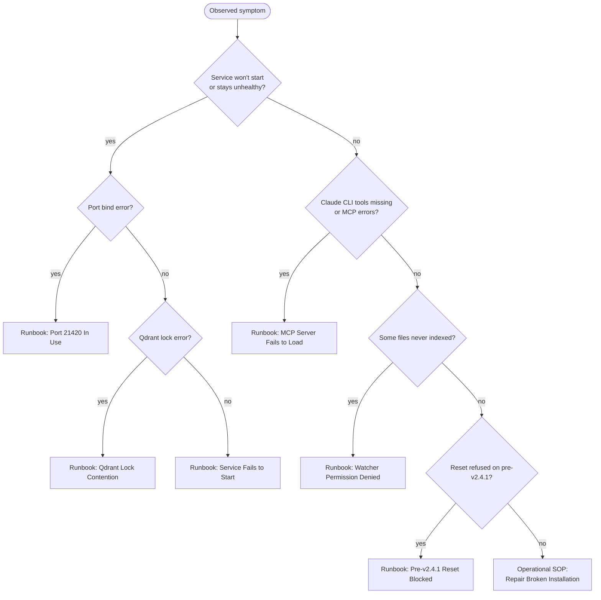

# Reference: Known Failure Codes

| | |
|---|---|
| **Owner** | TBD |
| **Last validated against version** | 2.4.2 |
| **Last reviewed** | 2026-04-18 |
| **Status** | **STUB** — awaiting authoritative catalog from [Q-2](Development-SOPs-Documentation-Open-Questions) and [Q-3](Development-SOPs-Documentation-Open-Questions) |

> **This is a scaffolded stub.** The `F-001..F-012` failure catalog and the `P-RULE` / `P-DEDUPE` pattern codes are referenced by the `rag-log-monitor` agent and the `/rag:rag-doctor` skill, but their authoritative definitions are not yet in the repo. Tables below are ready to populate; rows stay empty until the catalog is provided.

## Symptom → runbook router

Use this diagram to pick the right runbook before a failure code exists.

## `F-NNN` — Failure codes (BLOCKED)

Populated once [Q-2](Development-SOPs-Documentation-Open-Questions) resolves.

| Code | Name | Symptom | Runbook |
|---|---|---|---|
| F-001 | TBD | TBD | TBD |
| F-002 | TBD | TBD | TBD |
| F-003 | TBD | TBD | TBD |
| F-004 | TBD | TBD | TBD |
| F-005 | TBD | TBD | TBD |
| F-006 | TBD | TBD | TBD |
| F-007 | TBD | TBD | TBD |
| F-008 | TBD | TBD | TBD |
| F-009 | TBD | TBD | TBD |
| F-010 | TBD | TBD | TBD |
| F-011 | TBD | TBD | TBD |
| F-012 | TBD | TBD | TBD |

## `P-*` — Pattern codes (BLOCKED)

Populated once [Q-3](Development-SOPs-Documentation-Open-Questions) resolves.

| Code | Name | Pattern | Rule reference |
|---|---|---|---|
| P-RULE | TBD | TBD | TBD |
| P-DEDUPE | TBD | TBD | TBD |

## What is known today (unofficial taxonomy)

The `rag-log-monitor` agent watches 54 issue types. These are not the same as `F-NNN` codes, but they constitute the de-facto catalog the doctor flow uses. Grouped categories (from the agent definition):

- Python exceptions and tracebacks
- Failed test cases
- Qdrant lock / contention errors
- Qdrant collection errors
- Embedding-model load failures
- SQLite locking or corruption
- Config parse errors
- Import errors / missing dependencies
- MCP server startup / communication failures
- Watcher errors (permission denied, inotify limits)
- CLI command failures (Typer errors, bad arguments)
- HTTP route failures (404, 500, connection refused)
- Template / Jinja2 rendering errors
- Packaging issues (missing entry points, path resolution)
- Systemic repeated warnings
- Stuck states (hanging processes, infinite loops, timeouts)
- Deprecation warnings that may break
- Missing-implementation signals (`NotImplementedError`, TODO-triggered paths)

This page will be regenerated (not simply edited) once Q-2 / Q-3 provides an authoritative mapping from these categories to `F-NNN` codes with stable names and severities.

## Code paths (for the forthcoming catalog)

- `.claude/agents/rag-log-monitor.md` — current categorization source.
- `.claude/skills/` — `/rag:rag-doctor` skill (plugin-bundled) — classifier entry point.
- `src/ragtools/service/crash_history.py` — where persistent failure markers are written.

## Related

- Runbooks: [Service Fails to Start](Runbooks-Service-Fails-to-Start), [MCP Server Fails to Load](Runbooks-MCP-Server-Fails-to-Load), [Qdrant Lock Contention](Runbooks-Qdrant-Lock-Contention), [Port 21420 In Use](Runbooks-Port-21420-In-Use), [Watcher Permission Denied](Runbooks-Watcher-Permission-Denied), [Pre-v2.4.1 Reset Blocked](Runbooks-Pre-v2-4-1-Reset-Blocked).
- SOP: [Repair Broken Installation](Operational-SOPs-Repair-Repair-Broken-Installation).
- Open Questions: [Q-2](Development-SOPs-Documentation-Open-Questions), [Q-3](Development-SOPs-Documentation-Open-Questions).
