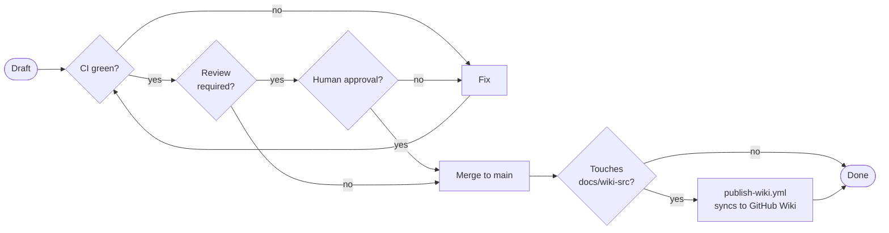

# Standards & Governance: Review and Merge Standards

| | |
|---|---|
| **Owner** | TBD (proposed: eng lead) |
| **Last validated against version** | 2.4.2 |
| **Last reviewed** | 2026-04-18 |

How PRs move from draft to merged to published.

## PR lifecycle

## Before opening a PR

- [ ] `pytest` passes locally.
- [ ] Changes scoped to the stated intent — no unrelated refactors.
- [ ] No commit bypasses (`--no-verify`, `--no-gpg-sign`) — if a hook fails, fix the cause.
- [ ] No new dependency added to `pyproject.toml` without justification in the PR description.
- [ ] If the change touches a documented behavior, the owning SOP / Runbook / Architecture page is also updated in the same PR (see [Documentation Standards](Standards-and-Governance-Documentation-Standards)).

## PR description

Short is fine. Include:

- **What** — one sentence.
- **Why** — one or two sentences. Links to issues or external context.
- **Testing** — which tests cover it; any manual checks performed.
- **Risk** — known. If "low, no user-facing change," say so explicitly.

Don't write a thousand-word description for a five-line change. Do write enough for a cold reviewer to understand scope.

## CI gate

- `.github/workflows/test.yml` runs `pytest` on Windows + macOS runners on every push. **Must be green before merge.**
- `.github/workflows/release.yml` runs on tag push — not a PR gate, but tag preparation requires a green PR first.
- `.github/workflows/publish-wiki.yml` (Phase 10) runs on `main` push when `docs/wiki-src/**` changes. Currently dry-run-only — does not block merge.

## Reviewer assignment

| PR touches... | Primary reviewer |
|---|---|
| `src/ragtools/service/` | Service owner |
| `src/ragtools/integration/` | MCP owner |
| `src/ragtools/indexing/`, `chunking/`, `retrieval/`, `embedding/` | Pipeline owner |
| `src/ragtools/config.py` | Lead eng (broad blast radius) |
| `pyproject.toml`, `installer.iss`, `scripts/build.py`, `.github/workflows/*` | Packaging / release owner |
| `docs/decisions.md` | Lead eng (ADR review) |
| `docs/wiki-src/**` | Docs lead; eng reviewer if code-linked content changed |
| `CLAUDE.md`, `.claude/**` | Lead eng |

Assignments will be filled with named individuals in Phase 10 per [Q-8](Development-SOPs-Documentation-Open-Questions).

## What requires explicit approval

- **Any ADR change.** Must have lead-eng sign-off. See [Architecture Decisions](Standards-and-Governance-Architecture-Decisions).
- **Any change to the single-process invariant** (ADR-1). Treat as an ADR change.
- **Release tag pushes.** The release-gate matrix in [Release Checklist](Development-SOPs-Release-Release-Checklist) must be green before tagging.
- **Wiki-src changes that update factual claims about the code** (e.g. config-key defaults, CLI flag behavior). Eng reviewer confirms the claim matches code.

## Merge rules

- **Squash merge** is the default. Keeps `main` history linear and readable.
- Merge commits are acceptable for multi-PR features if requested by the author and approved by the reviewer.
- **Do not force-push to `main`.** Ever.
- Tag operations: only from `main`, after a merged release PR. See [Release Checklist](Development-SOPs-Release-Release-Checklist).

## Commit messages

No strict convention enforced. Recommendations:

- Subject line < 72 chars, imperative mood ("Add", "Fix", "Remove" — not "Added", "Fixes").
- Body explains *why*, not *what*. The diff shows what.
- Release commits use the form `Release vX.Y.Z` (per `RELEASING.md`).
- Reference issues with `#NNN` in the body, not the subject.

## Post-merge responsibilities

- If the PR updated a documented behavior without updating the SOP/Runbook/Architecture page: open a follow-up doc PR **immediately**. A green merge is not complete until docs catch up.
- If the PR touched `docs/wiki-src/`: verify the Phase 10 `publish-wiki.yml` run (once activated) succeeded and the wiki reflects the change.

## Related

- [Coding Standards](Standards-and-Governance-Coding-Standards).
- [Testing Standards](Standards-and-Governance-Testing-Standards).
- [Documentation Standards](Standards-and-Governance-Documentation-Standards).
- [Release Checklist](Development-SOPs-Release-Release-Checklist).
