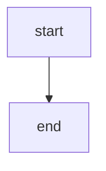

# Architecture: <Topic>

| | |
|---|---|
| **Owner** | TBD |
| **Last validated against version** | 2.4.2 |
| **Related decisions** | [Decision N](Standards-and-Governance-Architecture-Decisions) |

## Context
Why this component or flow exists. What problem it solves.

## Decision link
Link to the authoritative decision in `docs/decisions.md` and the rendered [Architecture Decisions](Standards-and-Governance-Architecture-Decisions) page.

## Diagram

## Walkthrough
Step-by-step narration of the flow. One paragraph per step. Each step names the responsible module or function.

## Code paths
Exact `file:line` references a reader can open.

- `src/ragtools/...` — ...

## Edge cases
Intentional behaviors that are not in the happy path.

- ...

## Invariants
Things that must always be true about this flow. Violating any is a bug.

- ...
