# Product Workflow Reference

> **Living document.** This file captures the core user and system workflows for RAG Tools by TaqaTechno.
> Update this file as workflows evolve. Diagrams use Mermaid syntax.

---

## Table of Contents

1. [Install and First Launch](#1-install-and-first-launch)
2. [First Project Setup](#2-first-project-setup)
3. [Multi-Project Management](#3-multi-project-management)
4. [Indexing](#4-indexing)
5. [Search](#5-search)
6. [Watcher](#6-watcher)
7. [Service Lifecycle](#7-service-lifecycle)
8. [Startup and Auto-Registration](#8-startup-and-auto-registration)
9. [Settings and Configuration](#9-settings-and-configuration)
10. [Error Recovery](#10-error-recovery)
11. [Release and Distribution](#11-release-and-distribution)

---

## 1. Install and First Launch

**Purpose:** Get the product running on a fresh Windows machine.

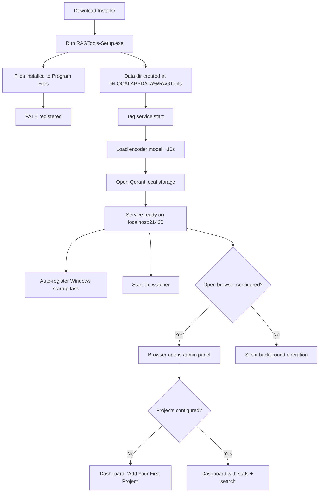

**Notes:**
- Installer is user-level (no admin required)
- Data directory is separate from install directory (survives upgrades)
- First startup takes 5-10 seconds for encoder model loading
- The Windows startup task auto-registers on first successful service start (no manual action needed)
- Watcher always starts automatically — not a configurable option

---

## 2. First Project Setup

**Purpose:** Go from empty knowledge base to first searchable content.

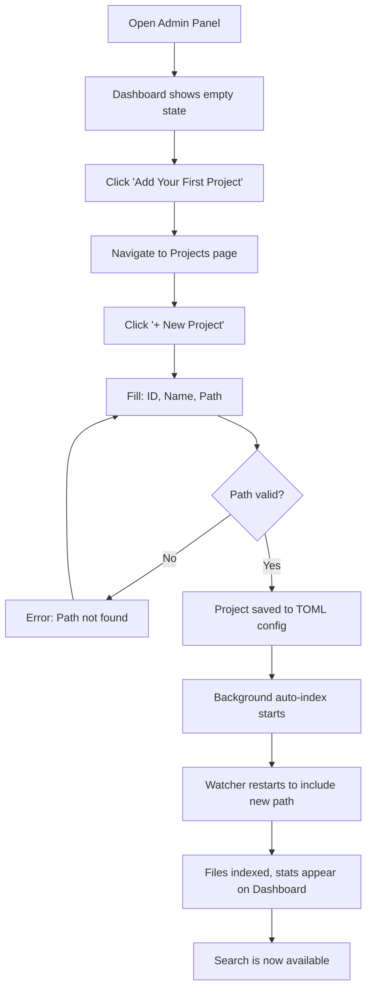

**CLI alternative:**
```
rag project add --name "My Docs" --path C:\path\to\docs
rag index                  # requires service running
rag search "my query"
```

**Notes:**
- Project ID is auto-generated from name (lowercase, hyphens) or manually specified
- Adding a project triggers auto-indexing in a background thread (non-blocking)
- Per-project ignore patterns are optional (Advanced section in the add form)
- The watcher automatically picks up the new project path

---

## 3. Multi-Project Management

**Purpose:** Organize multiple knowledge sources as separate projects.

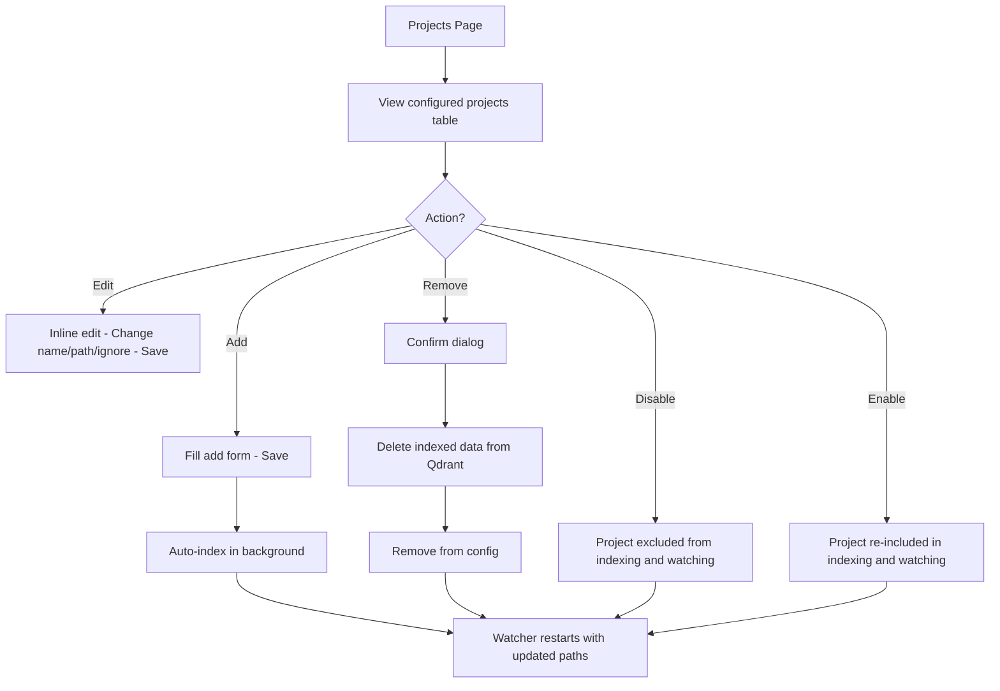

**Notes:**
- Each project has: id, name, path, enabled, ignore_patterns
- Disabling a project excludes it from indexing/watching but keeps existing indexed data in Qdrant
- Removing a project deletes all its indexed data from Qdrant and the state DB
- Watcher auto-restarts whenever the project list changes

---

## 4. Indexing

**Purpose:** Convert Markdown files into searchable vector embeddings.

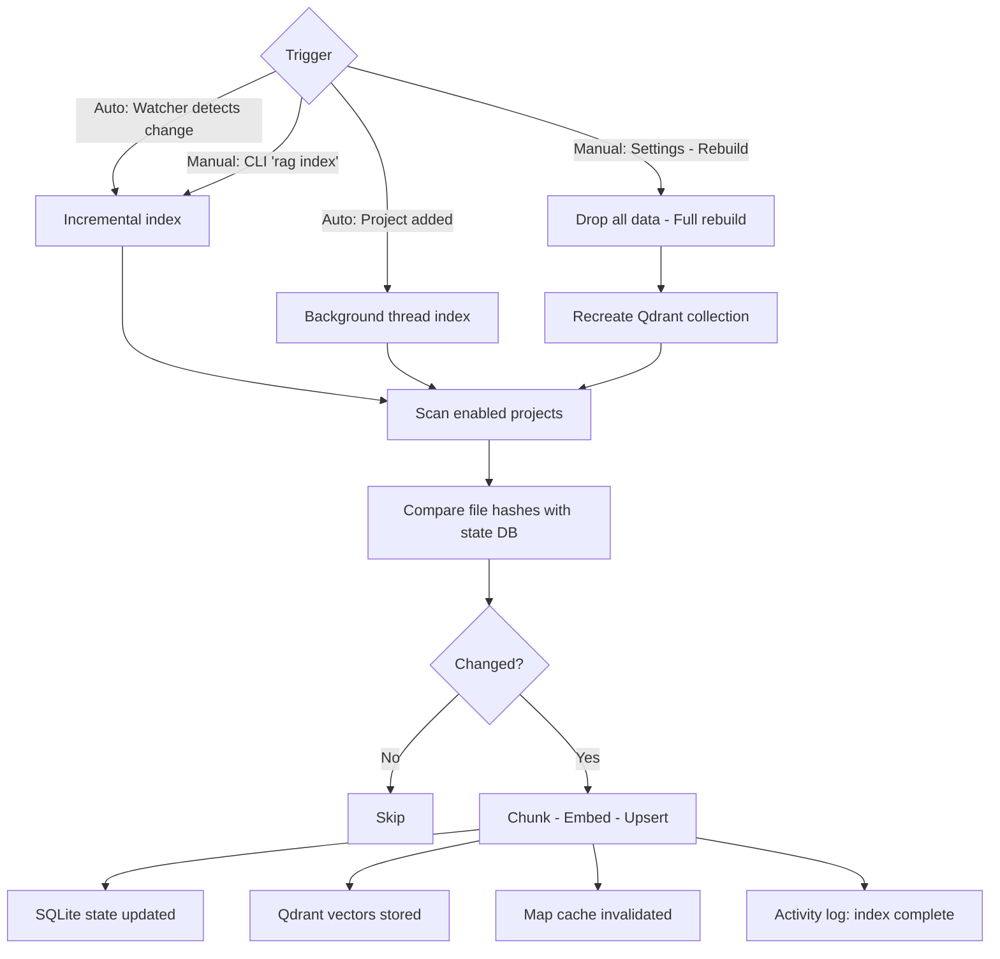

**Per-file pipeline:**
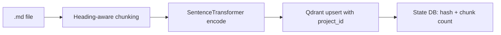

**Notes:**
- Incremental mode skips unchanged files (SHA256 hash comparison via SQLite)
- Chunk size: 400 tokens, overlap: 100 tokens (configurable in Settings)
- Each chunk gets a deterministic UUID: `sha256(project_id::file_path::chunk_index)`
- Ignore rules applied during scanning: built-in defaults, per-project patterns, .ragignore files
- Indexing holds the QdrantOwner RLock (search is blocked during indexing)
- CLI `rag index` requires the service to be running

---

## 5. Search

**Purpose:** Find relevant content across the knowledge base.

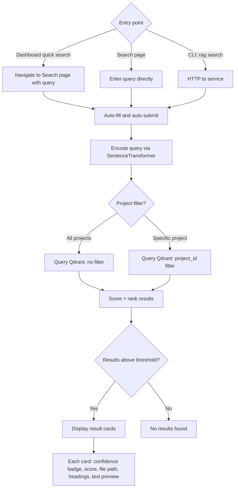

**Notes:**
- Dashboard has a quick search bar that navigates to the Search page with the query pre-filled
- Score threshold: 0.3 (results below this are excluded)
- Confidence labels: HIGH (>=0.7), MODERATE (0.5-0.7), LOW (<0.5)
- Default top_k: 10 results
- Search page shows a helpful empty state before first query
- Project dropdown shows only enabled configured projects

---

## 6. Watcher

**Purpose:** Keep the knowledge base current as files change on disk.

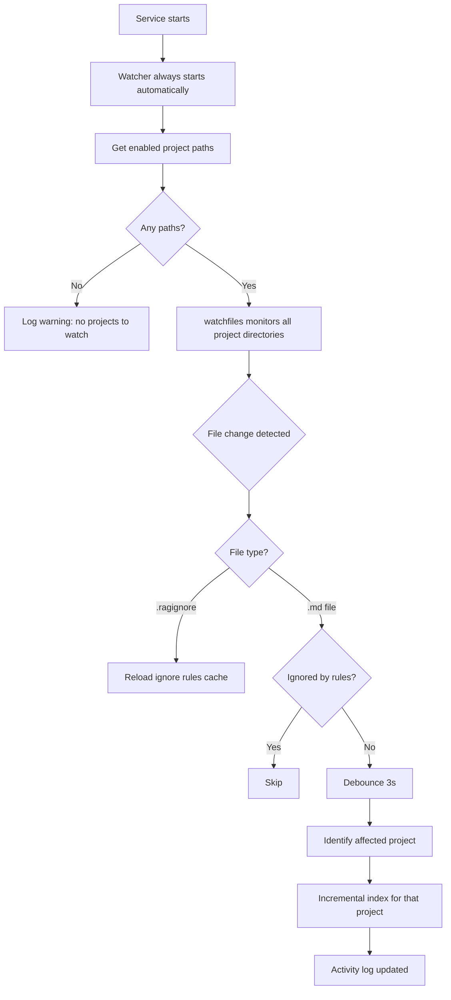

**Notes:**
- Watcher is always-on — starts automatically with the service, not configurable
- Uses `watchfiles` (Rust-based, low CPU overhead)
- Debounce: 3000ms (waits for file changes to settle before indexing)
- Watches all enabled project paths simultaneously
- Per-project ignore rules applied in the watch filter
- Watcher auto-restarts when projects are added, removed, enabled, or disabled

---

## 7. Service Lifecycle

**Purpose:** How the service starts, runs, and stops.

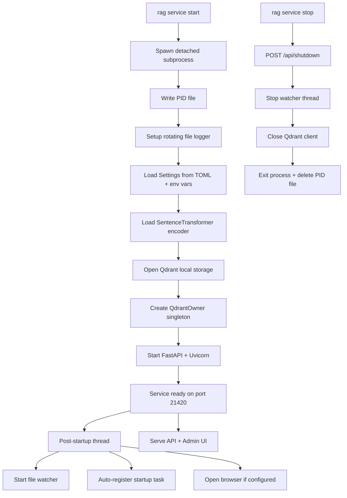

**Architecture:**
- Single process owns Qdrant exclusively (QdrantOwner with RLock)
- Watcher runs as a daemon thread inside the service process
- CLI commands route through HTTP when service is running
- MCP server uses per-request Qdrant access (releases lock between queries)

---

## 8. Startup and Auto-Registration

**Purpose:** Service starts automatically when user logs into Windows.

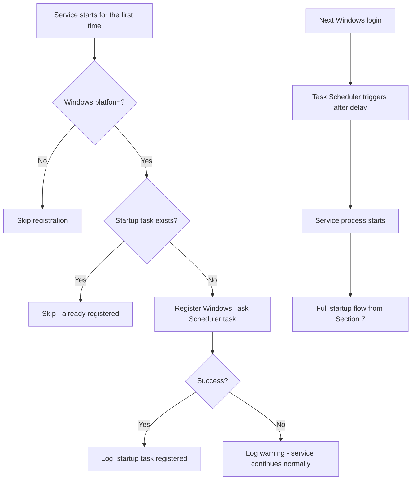

**Notes:**
- Auto-registration is idempotent (only registers once, checks first)
- Registration failure is non-fatal (logged as warning, service continues)
- Default delay: 30 seconds after login (configurable in Settings)
- Browser open on startup is optional (configurable in Settings)
- Manual control: `rag service install` / `rag service uninstall` CLI commands

---

## 9. Settings and Configuration

**Purpose:** How settings are managed and applied.

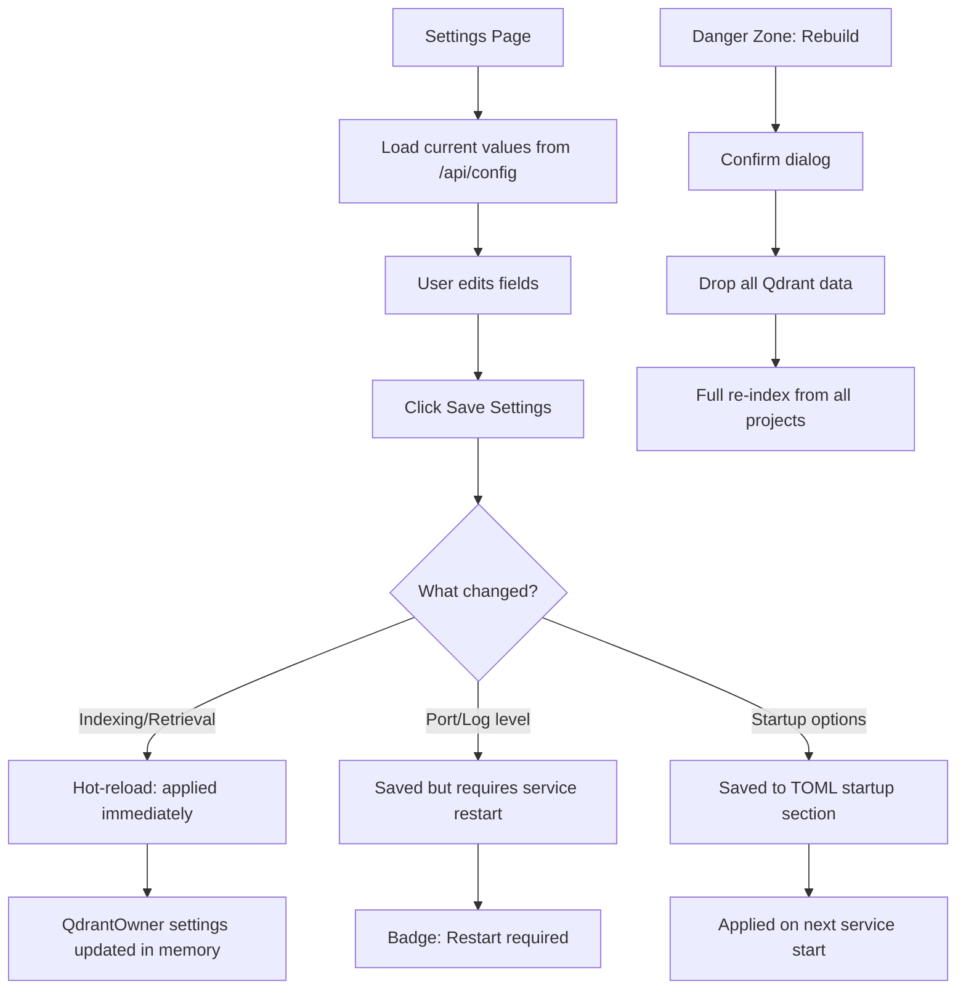

**Settings available in UI:**

| Section | Fields | Behavior |
|---------|--------|----------|
| Indexing | Chunk size, Chunk overlap | Hot-reload |
| Retrieval | Top K, Score threshold | Hot-reload |
| Service & Startup | Port, Log level | Restart required |
| Service & Startup | Open browser, Startup delay | Applied on next start |
| Danger Zone | Rebuild Knowledge Base | Destructive (confirm dialog) |

**Config sources (priority order):**
1. Environment variables (`RAG_*`)
2. TOML config file (`ragtools.toml`)
3. Built-in defaults

---

## 10. Error Recovery

**Purpose:** Diagnose and fix common issues.

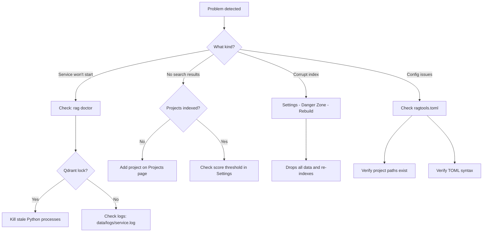

**Diagnostic commands:**
```
rag doctor          # System health check
rag status          # Index statistics
rag service status  # Service running?
rag project list    # Configured projects
```

---

## 11. Release and Distribution

**Purpose:** How a new version gets from code to user.

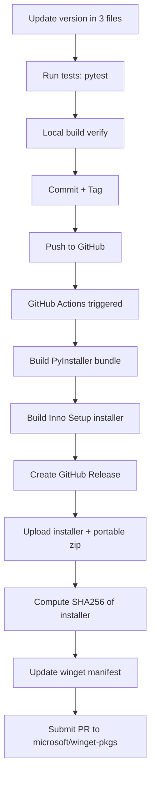

**Version locations:**
- `pyproject.toml` -> `version = "X.Y.Z"`
- `src/ragtools/__init__.py` -> `__version__ = "X.Y.Z"`
- `installer.iss` -> `#define MyAppVersion "X.Y.Z"`
